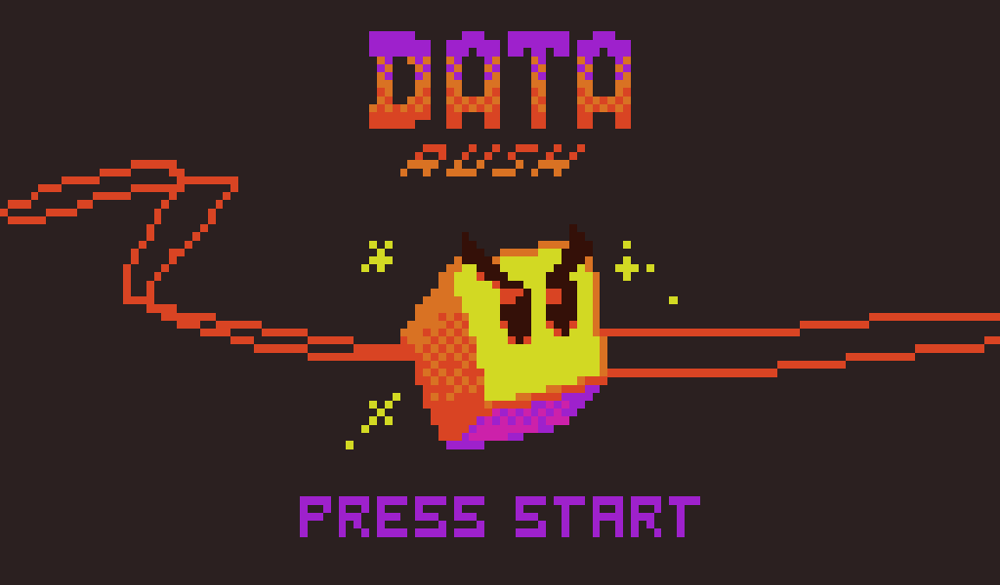

# Data Rush

[en] Data Rush is a game about an impetuous data packet thriving to reach its beloved user! Choose the fastest way in a random procedural generated map to reach the goal. 

[pt-BR] Data Rush é um jogo sobre um impetuoso pacote de dados tentando alcançar seu amado usuário! Escolha o caminho mais rápido em um mapa gerado aleatoriamente para atingir o objetivo.

**GGJ Page:** [Data Rusher](https://globalgamejam.org/2018/games/data-rush-0)

**Jam Site:** [Global Game Jam Santa Maria 2018](https://globalgamejam.org/2018/jam-sites/global-game-jam-santa-maria-2018)

**Jam year:** 2018

**Diversifiers:** 
 * **ACCESSIBILITY**
   * *One tap for all* - Create a game which can be played with one single well timed tap/click
 * **DESIGN** 
   * *I’ll be there in a minute* - Your game can be played through in 30 seconds or less.

**Platforms:**
 * MS Windows
 * Mac OS X
 * Linux / Unix

**Tools and Technologies:** [Godot Engine 3](https://godotengine.org/)

**Technology Notes:** Photoshop CC

## Credits: 

### Game Design:
 * Henrique Pereira
 * Rafael Trindade

### Programming:
 * Rafael Trindade

### Art:
 * Henrique Pereira

### Audio:
 * [**crymetothepalemoon**](http://www.facebook.com/crymetothepalemoon) - Sadness and Sorrow 8 Bit
 * [**Danimal Cannon**](https://danimalcannon.bandcamp.com) - Roots

